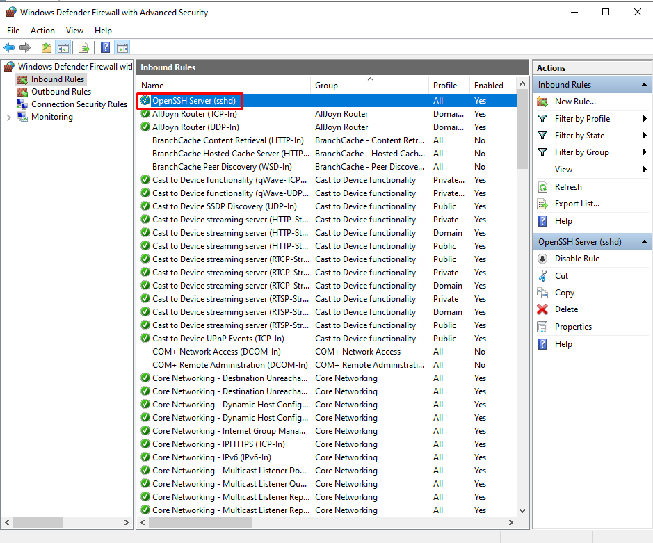
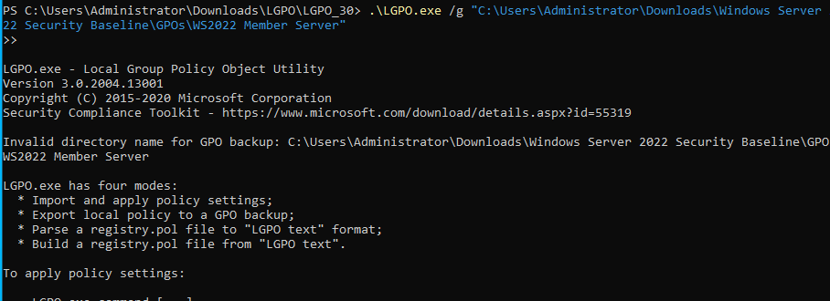
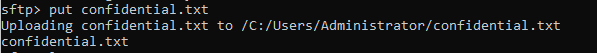
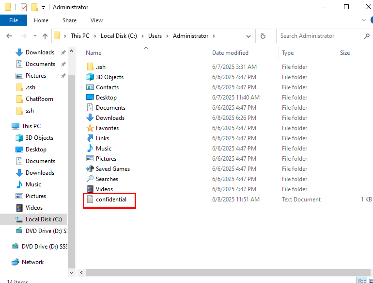
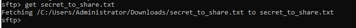
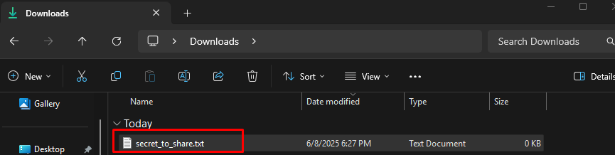
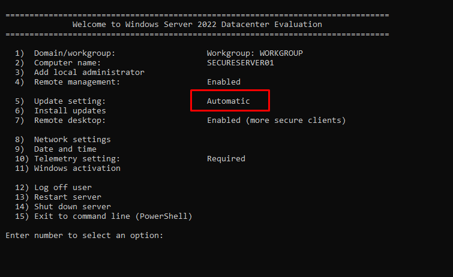
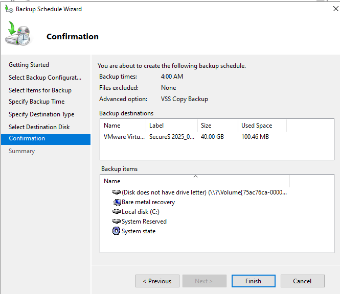
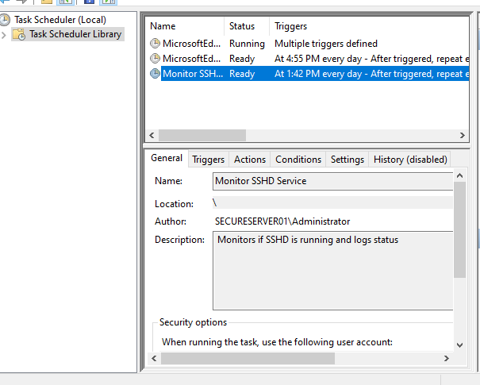

# Secure Private Messaging and File Transfer Server

A secure, hardened Windows Server 2022 deployment for private, end-to-end encrypted file transfers and messaging using OpenSSH, SFTP, and PowerShell.

## Project Summary
Deployed a secure Windows Server to enable encrypted messaging and file transfers without third-party services. Implemented system hardening, firewall rules, SSH key authentication, service monitoring, and backup systems to ensure privacy, security, and resilience.

## Technologies Used
- Windows Server 2022
- OpenSSH Server
- SFTP (SSH File Transfer Protocol)
- PowerShell Scripting
- Windows Firewall
- Microsoft Security Compliance Toolkit (LGPO)
- Task Scheduler (for backups and monitoring)

## Security Features
- Public Key Authentication (no passwords)
- SSH Hardening:
  - Disabled root login
  - Enforced strong ciphers and key exchange algorithms
  - Session timeouts to prevent idle abuse
- Hardened Windows Firewall:
  - Only Port 22 (SSH/SFTP) open
  - All other ports closed
- Microsoft Security Baseline Applied
- Disabled legacy insecure protocols:
  - SMBv1
  - TLS 1.0/1.1

## How to Connect
```bash
# SSH Secure Login
ssh username@server_ip

# Secure File Transfer via SFTP
sftp username@server_ip
```
- Authentication is handled via public key, ensuring no passwords are transmitted.
- All data is end-to-end encrypted using SSH tunnels.

## Encryption Details
- End-to-end encrypted SSH sessions using AES-256 or ChaCha20 ciphers.
- Public key authentication protects against brute-force and credential theft.
- No third-party services — complete privacy and control over sensitive data.

## Scripts
- **Monitor-SSHD.ps1**  
  PowerShell script to monitor the SSHD service and log service health status to a log file and Windows Event Log.

## Backup and Recovery
Configured Windows Server Backup for:
- Daily incremental backups
- Weekly full backups
- Backup to an external disk or secure offsite storage

Refer to [Disaster Recovery Playbook](/Disaster_Recovery_Playbook.md) for step-by-step recovery procedures in case of failure.

---

## Key Screenshots

### Firewall Rules (Port 22 Only Open)
Shows that only OpenSSH traffic (port 22) is allowed and other ports are restricted.


### Microsoft Security Baseline Applied
Security hardening applied using the LGPO tool for Windows Server 2022.


### Sending a File Securely via SFTP
SFTP upload (`put`) command to securely transfer a file to the server.


Send File to Server Success:


### Retrieving a File Securely via SFTP
SFTP download (`get`) command to securely fetch a file from the server.


Retrieve File from Server Success:


### Windows Automatic Updates Enabled
Automatic patching is enabled to ensure regular security updates.


### Server Backup Configuration
Windows Server Backup configured to enable full and incremental backups.


### Task Scheduler for Monitoring SSHD
PowerShell script scheduled to monitor the SSHD service health daily.


